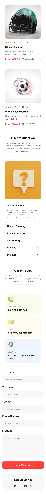
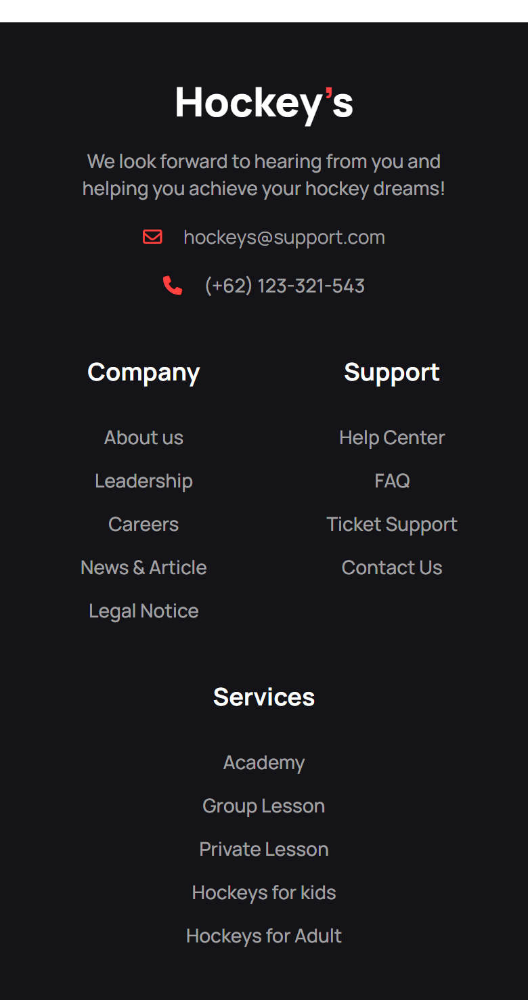

# Riders - Static Website

## Project Overview

Hockey’s is a static website built using HTML5 and styled with Tailwind CSS. The project incorporates the Daisy UI components to enhance the user interface and experience. It is designed to showcase various sections including Professional Hockeys Club, Program Sections, Our New Products, Clients Question(FAQ), Contact Information.

#### Live Preview: [Click here](https://sadiqur057.github.io/Hockeys/)

## Technologies Used

- HTML5
- Tailwind CSS
- Daisy UI Components

## Sections

- Professional Hockeys Club
- Program Sections
- Our New Products
- Clients Question(FAQ)

## Screenshots

  
Desktop view

  

  
Tablet view

  

  
Mobile view

